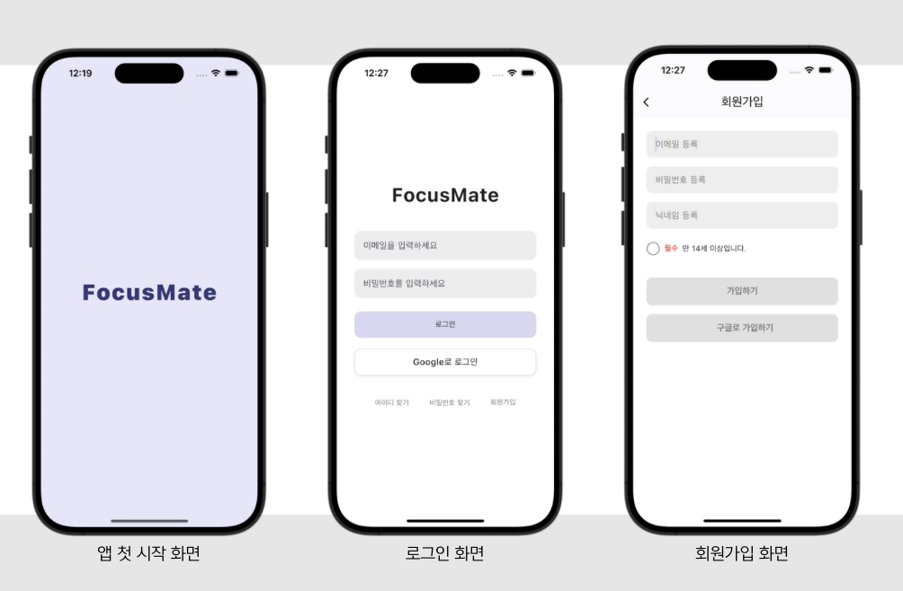
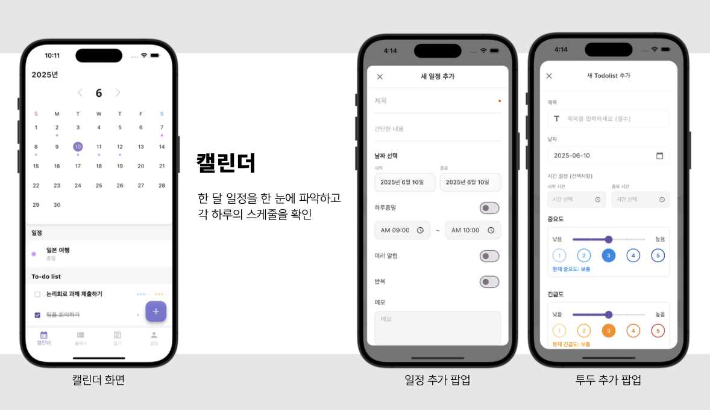
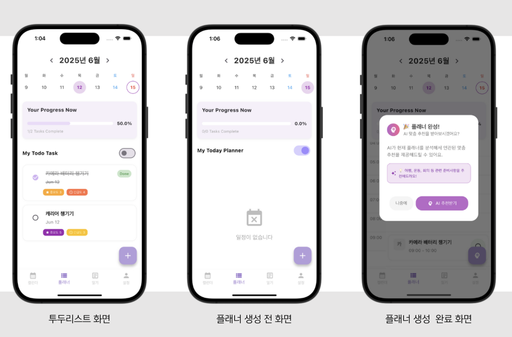
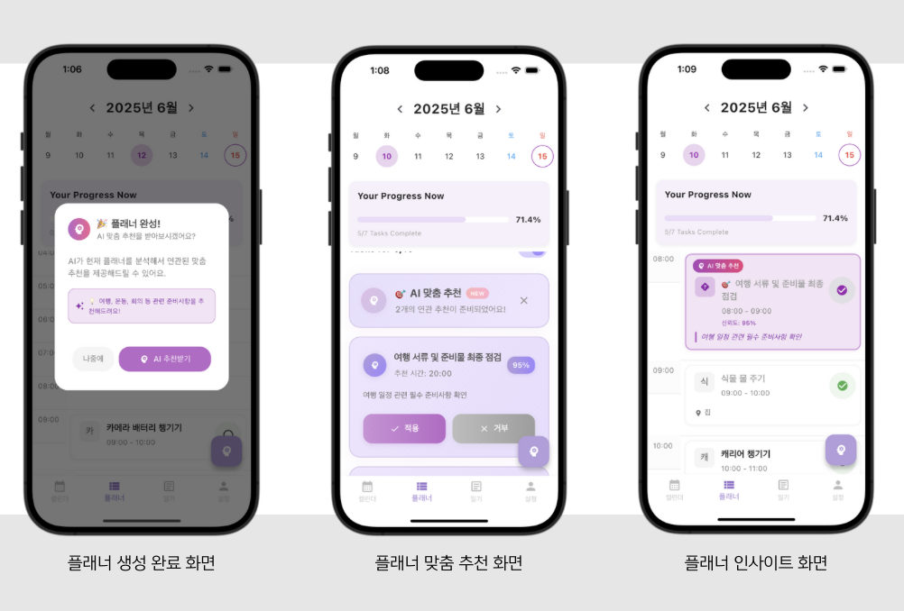
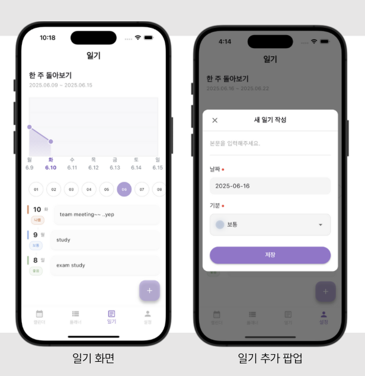
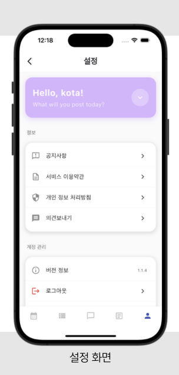

📅 FocusMate - AI 기반 플래너 앱

📖 프로젝트 개요  
Momentum 팀에서 개발한 FocusMate는 단순한 Todo-List를 넘어서,  
AI가 사용자의 일정에 맞춰 자동으로 플래너를 생성해주는 생산성 앱입니다.  

Flutter를 기반으로 전체 화면(UI)을 제작하고, Firebase로 인증/데이터 관리 및 기능 구현을 완료했습니다.  
AI 기능은 초기에는 Gemini API를 사용했고, 이후 직접 구축한 TensorFlow 기반 딥러닝 모델을 적용하여 발전시켰습니다.  

👥 제작 개요
- 팀명: Momentum  
- 앱명: FocusMate  
- 제작 기간: 2024.09 ~ 2025.07 (캡스톤 프로젝트)  
- 팀 인원: 4명 (프론트엔드 1명, 백엔드 2명, AI 및 프론트엔드 1명)  
- 역할 분담:  
  - 프론트엔드 (함지현): 캘린더 UI,일기 UI 구현(Flutter)
  - 프론트엔드 및 AI (최윤서): 로그인/회원가입,플래너·투두 UI, 설정 UI (FLutter) , Gemini API 연동 → TensorFlow 기반 딥러닝 모델 구축 
  - 백엔드 (최지수): Railway 서버 구축 및 관리
  - 백엔드 (한정윤): Railway 서버 구축 및 관리

🚀 주요 기능

🔑 로그인 / 회원가입 
 - 회원가입 / 로그인 (Firebase Auth 연동)  
 - 닉네임 변경,회원가입 및 회원 탈퇴 기능, 아이디 찾기 및 비밀번호 찾기 기능 구현 

  📸 로그인/회원가입 UI/UX
  
  
  

 📅 캘린더
 - 캘린더 화면에서 일정 확인 및 추가, 삭제 , 변경 기능 구현

 📸 캘린더 UI/UX
 
 

✅ 투두리스트 (Todo-List) 및 플래너
- 사용자가 할 일을 등록, 수정, 삭제 기능 구현  
- 일정과 연동되어 플래너 추천에 반영  
- 한 화면에서 플래너와 전환 가능
- 사용자가 투두리스트를 등록하면, 플래너 생성 버튼 클릭 시 AI가 빈 시간대 분석 후 추천  
- 플래너/투두 전환 스위치 버튼 구현

🤖 AI 기능 구현
1. 초기 단계
- Google Gemini API를 통해 빠르게 프로토타입 구현
- 사용자 Todo/스케줄 데이터를 API에 전달 → 추천 결과를 받아 플래너 자동 생성

2. 개선 단계
- Gemini API 의존성을 줄이고, 서비스 특화 기능을 위해 **TensorFlow 기반 딥러닝 모델** 구축
- Google Colab 환경에서 직접 모델 설계 및 학습
- 실제 사용자 데이터 수집이 어려워 GPT를 활용해 시뮬레이션 데이터 생성 후 학습
- 모델이 사용자의 빈 시간대를 분석해 맞춤형 일정 추천 제공

📸 투두리스트 / 플래너 UI/UX

 📔 일기 작성
- 사용자 개인 일기 작성 및 저장 , 삭제, 수정 기능 구현
- 일기 감정을 통해 일주일 간 감정 그래프 확인 할 수 있는 기능 구현
- 날짜별 일기 관리 기능

📸 일기 UI/UX

⚙️ 설정
- 닉네임 변경, 회원 탈퇴 기능 구현  
- 앱 내 계정 정보 관리 화면

📸 설정 UI/UX

🛠️ 기술 스택
- Frontend: Flutter  
- Backend: Firebase (인증 및 데이터 관리),Railway(서버)
- AI/ML: TensorFlow (Colab), Gemini API(초기), Custom 딥러닝 모델(개선)  

👩‍💻 팀원 기여
|  팀원   | 담당 기능 |
|  최윤서  | 프론트엔드 개발 및 AI : Flutter로 로그인/회원가입, 플래너/투두, 설정 화면 구현
AI 연동 및 모델 구축: Gemini API → TensorFlow(Colab) 기반 딥러닝 모델 직접 설계, 학습, 구축 |
| 함지현 | Flutter로 캘린더 화면 구현 , 일기 화면 구현 |
| 최지수 | Firebase 데이터 관리, Railway 서버 구축|
| 한정윤 | Firebase 데이터 관리, Railway 서버 구축 |

📺 Demo Video
- 프로젝트 시연 및 발표 영상
- [데모 영상 링크](여기에_유튜브_또는_구글드라이브_링크_삽입)  

 🚩 문제 해결 과정 및 협업
프로젝트 중 발생한 주요 이슈와 해결 과정을 기록했습니다.  
팀은 노션, 구글 문서, 디스코드, 피그마를 활용하여 팀원들과의 효율적인 협업을 진행했습니다.

📂 협업 & 문서
- Google Docs: 공유 문서 작성  
- Notion: 진행 상황 체크, 문제점 및 해결 방법 기록
  자세한 문제/해결 기록은 아래의 링크에서 확인 가능합니다.
  - https://www.notion.so/1bb5673b8f57806e994bd15ec085a9b3?      v=1bb5673b8f5780138db2000c6b34af94&source=copy_link
  - https://www.notion.so/1bb5673b8f5780e498bcc1811b0a0170?v=1bb5673b8f57801991c6000c548d306c&source=copy_link
- Discord: 실시간 팀 소통 및 피드백  
- Figma:  UI/UX 스케치 및 화면 설계

📌 기대 효과
- 단순한 할 일 관리 앱을 넘어, 사용자 맞춤형 AI 플래너 제공  
- API 활용에서 직접 모델 구축으로 발전하며 데이터 수집·학습·검증 전체 사이클 경험
- 실무에 가까운 협업 환경(깃허브 + 노션 + CI/CD)을 경험하며 개발 및 문제 해결 능력 강화  
